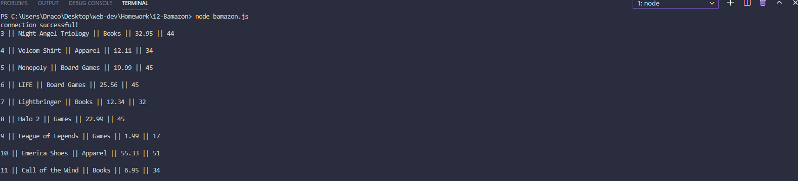

# Bamazon

### Description 
In this activity, you'll be creating an Amazon-like storefront with the MySQL skills you learned this unit. The app will take in orders from customers and deplete stock from the store's inventory.

### Steps
1. Clone repository 
2. Open a terminal and CD to repo folder
3. npm install
4. node bamazon.js 

